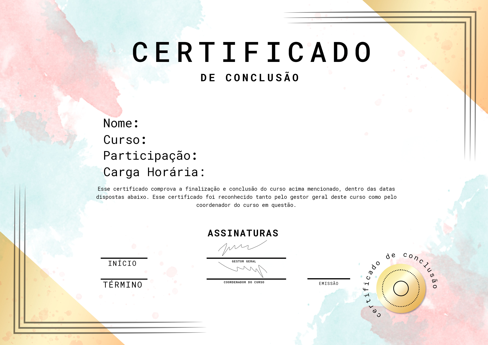

# Automação de Certificados feito em PyTHON




> Aplicação feita como estudo de Python para automatizar certificados de conclusão de cursos.

## ☕ Sobre o projeto?

- Inicialmente, terá uma imagem em .jpg que precisa ser mapeada antes para encontrar os pontos X e Y da posição dos campos a serem preenchidos. 

> Dica: Use o paint para ver as coordenadas da imagem.

## 💻 Pré-requisitos

- Ter o Python instalado na sua máquina

## 🚀 Como usar?


- Com o python instalado na sua máquina, acesse o terminal e, para utilizar um ambiente virtual separado da localização do seu PC, use o comando abaixo

```sh
python -m venv "NOME_DO_SEU_AMBIENTE"
```

> [!TIP]
> Pode ser qualquer nome. Ex: teste, seu nome...enfim

- Depois, ativar o seu ambiente com o comando abaixo

```bash
"NOME_DO_SEU_AMBIENTE"\Scripts\activate 
```
aparecerá desta forma:

```bash
("NOME_DO_SEU_AMBIENTE") PS C:\local_da_pasta_que_vocÊ_está>
```
- Istalar as dependências utilizando o comando abaixo:
  - Pillow: Utilizado para sobreposição de texto
  - OpenPyXL: Utilizado para ler as planilhas

```bash
pip install pillow openpyxl
```

- Adicionar os arquivos dentro da pasta assets/
 - data/`<seu_arquivo_excel.xlsx>`
 - images/`<seu_certificado_padrao.jpg>`
 - fonts/`<fonte_para_ser_utilizada.ttf>`
 
 > No caso, estou utilizando tahoma para textos normais e tahomabd para destacar

- Rodando o sistema ele irá gerar os nomes dos alunos em caixa baixa, sem acentos gerar o arquivo em jpg, png ou pdf 

> Padrão: PDF

## 🔑 Licença

Desenvolvido por [Diogo Oliveira Lins](https://goatech.com.br)